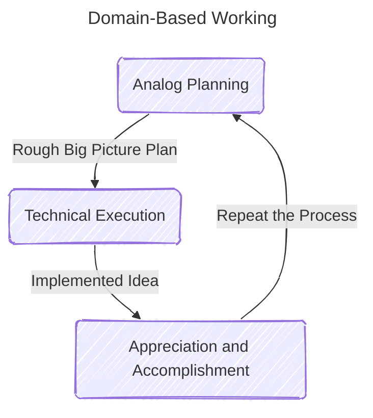

#reflection #gamedev

I find it easiest to be productive during times of low motivation if I just stick to one area of development on my project and enter the [[flow state]].

For example, during the past two weeks I was able to lock in for coding ([[Untitled Alien Game Devlog 1 (2024-10-06)|see the devlog here]]) and pump out a bunch of new systems. For coding it definitely helped that I planned things out away from the computer first.

I did this similarly with designing some draft GUIs and menus.

## Proposed Methodology

_(I made this diagram from mermaid code using the [Mermaid Live Editor](https://mermaid.live/))_
### 1. Analog, offline planning 

Coming up with a plan offline, while away from the computer provides the most clarity and flexibility of thought. I feel that I am without borders and bounds when I take my drafting / ideation notebook and just start sketching out or writing whatever comes to mind.

### 2. Execution

With the plan loosely set out on paper, I can begin implementing it on the computer without having to think to heavily about the fuzzy creative stuff. I can focus on **delivering**.

### 3. Appreciation

Once implemented, I usually feel pretty proud and accomplished about what I have done after following this process.
