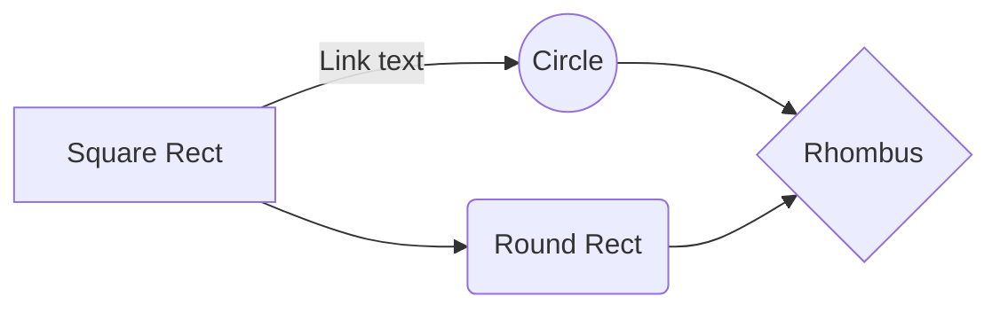

---
tags:
  - project/alien-game
description: An overview of the various gameplay systems for the game.
title: 
draft: "true"
---
# Overview of Systems

## Player Interaction

## Ship Systems

## Alien System

# Related Notes
- 